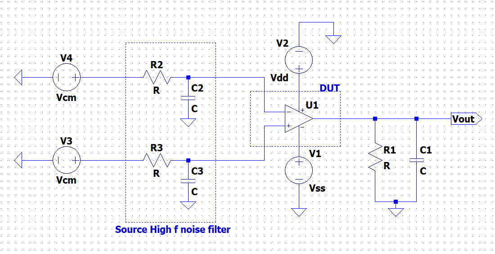

# CMOS Amplifier Characterization Testbench Library

A standardized simulation testbench library for the characterization of CMOS amplifiers, OTAs, operational amplifiers, and fully differential amplifiers.

The same characterization framework is intended to be used for:

- Schematic-level netlists
- LVS-clean extracted netlists
- Post-layout PEX netlists
- PVT simulations
- Monte Carlo / mismatch simulations

The main goal is to use a **common and reproducible set of testbenches** so that amplifier architectures can be compared using the same measurement methodology.

---

# Documentation Hub

> **Documentation Portal:** [Overview](docs/index.md) • [Amplifier Classes](docs/amplifier_classes.md) • [Testbench Matrix & PEX](docs/testbench_matrix.md) • [Academic References](docs/references.md)

## Testbench Navigation

| ID | Testbench | Main Parameters |
|---|---|---|
| [TB00](docs/TB00_DC_Operating_Point.md) | DC Operating Point & Power | Bias current, supply current, power, operating point |
| [TB01](docs/TB01_AC_Gain.md) | Open-Loop AC Gain | DC gain, bandwidth, UGF, poles/zeros |
| [TB02](docs/TB02_Differential_Gain.md) | Differential AC Gain | Differential gain, GBW |
| [TB03](docs/TB03_Stability.md) | Loop Gain & Stability | Loop gain, phase margin, gain margin |
| [TB04](docs/TB04_CMRR.md) | CMRR | Differential gain, common-mode gain, CMRR |
| [TB05](docs/TB05_PSRR.md) | PSRR | PSRR+, PSRR− |
| [TB06](docs/TB06_OTA_Gm_Rout.md) | OTA Transconductance & Output Resistance | \(G_m\), \(R_{out}\) |
| [TB07](docs/TB07_Input_Offset.md) | Input Offset | Systematic offset, mismatch offset |
| [TB08](docs/TB08_ICMR.md) | Input Common-Mode Range | \(V_{ICMR,min}\), \(V_{ICMR,max}\) |
| [TB09](docs/TB09_Output_Swing.md) | Output Swing | \(V_{out,min}\), \(V_{out,max}\) |
| [TB10](docs/TB10_Transient.md) | Slew Rate & Settling | SR+, SR−, settling, overshoot |
| [TB11](docs/TB11_Noise.md) | Noise | Input/output noise, integrated noise |
| [TB12](docs/TB12_THD.md) | THD & Linearity | THD, HD2, HD3 |
| [TB13](docs/TB13_FD_Differential_Mode.md) | Fully Differential DM Characterization | Differential gain and stability |
| [TB14](docs/TB14_CMFB.md) | CMFB Characterization | CMFB gain, bandwidth, phase margin |
| [TB15](docs/TB15_Local_Loop_Stability.md) | Local Loop Stability | Gain booster / regulated cascode stability |
| [TB16](docs/TB16_Load_Sweep.md) | Load Characterization | Performance versus \(C_L\), \(R_L\) |
| [TB17](docs/TB17_PVT.md) | PVT Characterization | Process, voltage, temperature |
| [TB18](docs/TB18_Monte_Carlo.md) | Monte Carlo | Offset, statistical variation, yield |

---

# Amplifier Classification

## Class A — Single-Input / Single-Output Gain Stages

Architectures:

- Cascode amplifier
- Wide-swing cascode amplifier
- Regulated cascode amplifier

Typical testbenches:

- TB00 — DC Operating Point
- TB01 — AC Gain
- TB05 — PSRR
- TB09 — Output Swing
- TB11 — Noise
- TB12 — THD

Additional requirement:

- Regulated Cascode → TB15 Local Loop Stability

---

## Class B — Differential-Input / Single-Ended Amplifiers

Architectures:

- NMOS differential pair
- PMOS differential pair
- Active-load differential pair
- Complementary differential pair
- 5-transistor OTA
- Current-mirror OTA

Typical testbenches:

- TB00 — DC Operating Point
- TB02 — Differential Gain
- TB04 — CMRR
- TB05 — PSRR
- TB06 — \(G_m\) / \(R_{out}\)
- TB07 — Input Offset
- TB08 — ICMR
- TB11 — Noise
- TB12 — THD

Complementary differential pairs should additionally be characterized using:

\[
G_m(V_{CM})
\]

to evaluate NMOS/PMOS handover.

---

## Class C — OTAs and Single-Ended Op-Amps

Architectures:

- Telescopic OTA
- Folded-cascode OTA
- Gain-boosted OTA
- Single-stage op-amp
- Two-stage Miller op-amp
- Three-stage op-amp
- Gain-boosted op-amp

Typical testbenches:

- TB00
- TB02
- TB03
- TB04
- TB05
- TB07
- TB08
- TB09
- TB10
- TB11
- TB12

Additional tests:

- Gain-boosted OTA → TB15
- Gain-boosted op-amp → TB15
- Three-stage op-amp → internal/local loop stability where applicable

---

## Class D — Fully Differential Amplifiers

Architectures:

- Fully differential telescopic amplifier
- Fully differential folded-cascode amplifier
- Fully differential two-stage amplifier
- Fully differential amplifier with CMFB

Typical testbenches:

- TB00
- TB02
- TB04
- TB05
- TB07
- TB08
- TB09
- TB10
- TB11
- TB12
- TB13
- TB14

Two different feedback modes must be verified:

\[
\text{Differential-Mode Loop}
\]

and

\[
\text{Common-Mode Feedback Loop}
\]

---

# TB00 — DC Operating Point & Power

## Purpose

Measure:

- Supply current
- Static power
- Output DC operating point
- Internal bias conditions
- MOS transistor operating regions

## Testbench Schematic



> Placeholder schematic. Replace with the finalized standardized testbench schematic.

## Circuit Configuration

Bias the DUT at its nominal operating condition.

Use:

\[
V_{DD}=V_{DD,nom}
\]

For a dual-supply design:

\[
V_{SS}=V_{SS,nom}
\]

Connect the nominal output load.

## Simulation

Use:

- DC operating-point analysis
- DC node-voltage measurements
- Device operating-point extraction

## Measurements

Measure:

\[
I_{DD}
\]

and, when applicable:

\[
I_{SS}
\]

Calculate static power:

\[
P_{DC}
=
V_{DD}I_{DD}
+
|V_{SS}I_{SS}|
\]

Record where available:

- \(V_{GS}\)
- \(V_{DS}\)
- \(V_{DSAT}\)
- \(g_m\)
- \(g_{ds}\)
- transistor operating region

## Plots

Normally no frequency-domain plot is required.

Useful plots:

- Supply current versus supply voltage
- Power versus temperature
- Bias current versus process corner

## Reference

### Allen & Holberg — Simulation and Measurement of Op Amps

**Reference:**  
Phillip E. Allen and Douglas R. Holberg, *CMOS Analog Circuit Design*.

**Link:**  
https://pallen.ece.gatech.edu/Academic/ECE_6412/Spring_2003/L240-Sim%26MeasofOpAmps%282UP%29.pdf

**Relevant content:**  
Practical simulation and measurement techniques for CMOS op-amps including DC behavior, power, transfer characteristics, offset, CMRR, PSRR, ICMR, and transient response.

---

# TB01 — Open-Loop AC Gain

## Purpose

Measure:

- Low-frequency gain
- Open-loop gain
- \(-3\,\mathrm{dB}\) bandwidth
- Unity-gain frequency
- Poles
- Zeros

## Testbench Schematic


## Circuit Configuration

For a single-ended gain stage:

\[
V_{in}
=
V_{bias}+V_{AC}
\]

Use:

\[
V_{AC}=1\,V
\]

Connect the required nominal load:

\[
C_L=C_{L,nom}
\]

and, when applicable:

\[
R_L=R_{L,nom}
\]

## Simulation

Run an AC sweep from well below the expected dominant pole to well above the expected unity-gain frequency.

Example:

```text
AC DEC 50 1Hz 10GHz
```

The actual frequency limits must be selected for the expected amplifier bandwidth.

## Calculation

\[
A_v(f)
=
\frac{V_{out}(f)}
{V_{in}(f)}
\]

If:

\[
V_{in,AC}=1V
\]

then numerically:

\[
A_v(f)=V_{out}(f)
\]

Gain in dB:

\[
A_{v,dB}
=
20\log_{10}|A_v|
\]

## Plots

### Gain

X-axis:

Frequency, logarithmic.

Y-axis:

\[
20\log_{10}|A_v|
\]

### Phase

X-axis:

Frequency, logarithmic.

Y-axis:

\[
\angle A_v
\]

Extract:

- DC gain
- \(-3\) dB bandwidth
- UGF
- dominant pole
- secondary poles/zeros

## Reference

### Razavi — Design of Analog CMOS Integrated Circuits

**Reference:**  
Behzad Razavi, *Design of Analog CMOS Integrated Circuits*.

**Link:**  
https://www.mheducation.com/highered/product/design-of-analog-cmos-integrated-circuits-razavi

**Relevant content:**  
Single-stage amplifier gain, frequency response, poles, zeros, bandwidth, differential amplifiers, op-amps, and compensation.

---

# TB02 — Differential AC Gain

## Purpose

Measure:

- Differential gain
- Differential bandwidth
- Differential UGF / GBW

## Testbench Schematic


## Circuit Configuration

Apply differential excitation around a fixed common-mode voltage.

\[
V_{in+}
=
V_{CM}
+
\frac{V_d}{2}
\]

\[
V_{in-}
=
V_{CM}
-
\frac{V_d}{2}
\]

For AC analysis:

```text
VIN+ : DC = VCM, AC = +0.5
VIN- : DC = VCM, AC = -0.5
```

Therefore:

\[
V_{id}
=
V_{in+}-V_{in-}
=
1V
\]

## Single-Ended Output

\[
A_d(f)
=
\frac{V_{out}}
{V_{in+}-V_{in-}}
\]

## Fully Differential Output

\[
A_d(f)
=
\frac{V_{out+}-V_{out-}}
{V_{in+}-V_{in-}}
\]

## Plots

Plot:

\[
20\log_{10}|A_d(f)|
\]

and:

\[
\angle A_d(f)
\]

Extract:

- \(A_0\)
- GBW
- UGF
- bandwidth
- phase response

## Reference

### Razavi — Differential Amplifiers

**Link:**  
https://www.mheducation.com/highered/product/design-of-analog-cmos-integrated-circuits-razavi

**Relevant content:**  
Differential-pair operation, differential gain, common-mode behavior, frequency response, and op-amp architectures.

---

# TB03 — Loop Gain & Stability

## Purpose

Measure:

- Loop gain
- Unity-loop-gain frequency
- Phase margin
- Gain margin

## Testbench Schematic


## Circuit Configuration

Keep the amplifier in its intended closed-loop operating condition.

Insert a loop probe or return-ratio injection source into the feedback loop while preserving the DC operating point.

Conceptually:

```text
             +----------------------+
Vin -------->| +                    |
             |        DUT           |---- Vout
        +--->| -                    |
        |    +----------------------+
        |                |
        |    Feedback    |
        +---[Loop Probe]-+
```

## Measurement

Measure:

\[
T(j\omega)
\]

Plot:

\[
20\log_{10}|T(j\omega)|
\]

and:

\[
\angle T(j\omega)
\]

At:

\[
|T(j\omega_u)|=1
\]

calculate:

\[
PM
=
180^\circ
+
\angle T(j\omega_u)
\]

For gain margin, find:

\[
\angle T=-180^\circ
\]

and measure the loop-gain magnitude at that frequency.

## References

### Middlebrook — Measurement of Loop Gain in Feedback Systems

**Link:**  
https://doi.org/10.1080/00207217508920421

**Relevant content:**  
Classical loop-gain measurement using return-ratio and injection methods while preserving the feedback circuit operating condition.

### Neag et al. — Phase and Gain Margin Simulation Methods

**Link:**  
https://doi.org/10.1109/TCSI.2014.2370151

**Relevant content:**  
Comparison of multiple simulation-based methods for determining phase margin and gain margin in op-amp feedback circuits.

---

# TB04 — CMRR

## Purpose

Measure:

- Differential gain
- Common-mode gain
- CMRR
- CMRR versus frequency

## Testbench Schematic


## Differential-Mode Simulation

Use:

```text
VIN+ : AC = +0.5
VIN- : AC = -0.5
```

Measure:

\[
A_d(f)
\]

## Common-Mode Simulation

Use:

```text
VIN+ : AC = 1
VIN- : AC = 1
```

Measure:

\[
A_{CM}(f)
\]

For a single-ended output:

\[
A_{CM}
=
\frac{V_{out}}{V_{CM}}
\]

For a fully differential amplifier:

\[
A_{CM\rightarrow DM}
=
\frac{V_{out+}-V_{out-}}
{V_{CM}}
\]

## Calculation

\[
CMRR(f)
=
20\log_{10}
\left|
\frac{A_d(f)}
{A_{CM}(f)}
\right|
\]

## Plots

Plot:

\[
CMRR(f)
\]

in dB versus logarithmic frequency.

Also save:

- DC CMRR
- CMRR at selected frequencies
- worst CMRR over the specified operating bandwidth

## Reference

### Razavi — Differential Amplifiers

**Link:**  
https://www.mheducation.com/highered/product/design-of-analog-cmos-integrated-circuits-razavi

**Relevant content:**  
Differential gain, common-mode gain, mismatch, differential-pair operation, and CMRR.

---

# TB05 — PSRR

## Purpose

Measure:

- PSRR+
- PSRR−
- Power-supply rejection versus frequency

## Testbench Schematic


## PSRR+ Setup

Set signal-input AC excitation to zero.

```text
VIN+ AC = 0
VIN- AC = 0
```

Excite the positive supply:

```text
VDD = VDD_DC + AC 1
```

Measure:

\[
A_{VDD}(f)
=
\frac{V_{out}}
{V_{DD,AC}}
\]

Calculate:

\[
PSRR^+(f)
=
20\log_{10}
\left|
\frac{A_d(f)}
{A_{VDD}(f)}
\right|
\]

## PSRR− Setup

Use:

```text
VDD AC = 0
VSS AC = 1
```

Calculate:

\[
PSRR^-(f)
=
20\log_{10}
\left|
\frac{A_d(f)}
{A_{VSS}(f)}
\right|
\]

## Plots

Plot:

- PSRR+ versus frequency
- PSRR− versus frequency

Use logarithmic frequency axis.

## References

### Ribner & Copeland — Cascoded CMOS Op-Amps with Improved PSRR

**Link:**  
https://doi.org/10.1109/JSSC.1984.1052246

**Relevant content:**  
Detailed analysis of power-supply rejection and common-mode input range in cascoded CMOS operational amplifiers.

### Razavi — Power Supply Rejection

**Link:**  
https://www.mheducation.com/highered/product/design-of-analog-cmos-integrated-circuits-razavi

**Relevant content:**  
Op-amp PSRR mechanisms and frequency dependence.

---

# TB06 — OTA Transconductance & Output Resistance

## Purpose

Measure:

- OTA transconductance
- Low-frequency \(g_m\)
- Output resistance
- Intrinsic voltage gain

## Testbench Schematic


## Transconductance Measurement

Apply:

\[
V_{id}=1V_{AC}
\]

Hold the output at its nominal DC operating voltage using an ideal voltage source or equivalent AC-grounded sensing element.

Measure:

\[
I_{out}
\]

Calculate:

\[
G_m(f)
=
\frac{I_{out}(f)}
{V_{id}(f)}
\]

At low frequency:

\[
g_m
=
G_m(0)
\]

## Output Resistance

AC-ground the signal inputs.

Inject:

\[
I_{test}=1A_{AC}
\]

at the output.

Calculate:

\[
R_o(f)
=
\frac{V_o(f)}
{I_{test}(f)}
\]

With:

\[
I_{test}=1A
\]

numerically:

\[
R_o(f)=V_o(f)
\]

Check:

\[
A_0
\approx
G_mR_o
\]

## Reference

### Razavi — Differential Amplifiers and Operational Amplifiers

**Link:**  
https://www.mheducation.com/highered/product/design-of-analog-cmos-integrated-circuits-razavi

**Relevant content:**  
Transconductance, output resistance, intrinsic gain, current mirrors, differential pairs, and OTA/op-amp architectures.

---

# TB07 — Input Offset

## Purpose

Measure:

- Systematic input offset
- Mismatch-induced input offset
- Offset mean
- Offset standard deviation

## Testbench Schematic


## Setup

Apply:

\[
V_{in+}
=
V_{CM}
+
\frac{V_{OS,test}}{2}
\]

\[
V_{in-}
=
V_{CM}
-
\frac{V_{OS,test}}{2}
\]

Sweep \(V_{OS,test}\) around zero.

## Calculation

For a differential output find:

\[
V_{od}=0
\]

where:

\[
V_{od}=V_{out+}-V_{out-}
\]

Then:

\[
V_{OS}
=
V_{id}\big|_{V_{od}=0}
\]

For Monte Carlo:

\[
\mu_{VOS}
\]

\[
\sigma_{VOS}
\]

and optionally:

\[
V_{OS,3\sigma}
=
3\sigma_{VOS}
\]

## Plots

- Histogram of \(V_{OS}\)
- Offset probability distribution
- Offset versus process/sample index

## Reference

### Gray & Meyer — MOS Operational Amplifier Design: A Tutorial Overview

**Link:**  
https://doi.org/10.1109/JSSC.1982.1051851

**Relevant content:**  
Classic CMOS/MOS op-amp performance treatment including gain, offset, CMRR, PSRR, power, noise, and transient behavior.

---

# TB08 — Input Common-Mode Range

## Purpose

Measure:

\[
V_{ICMR,min}
\]

and:

\[
V_{ICMR,max}
\]

## Testbench Schematic


## Closed-Loop Op-Amp Method

Configure the amplifier as a unity-gain buffer.

```text
             +----------------+
Vin -------->| +              |
             |      DUT       |---- Vout
        +--->| -              |
        |    +----------------+
        |           |
        +-----------+
```

Sweep:

\[
V_{in}
\]

from near the lower rail to near the upper rail.

## Measurements

Plot:

\[
V_{out}
\]

versus:

\[
V_{in}
\]

Also plot:

\[
V_{out}-V_{in}
\]

Define a fixed error criterion.

The valid region is:

\[
V_{ICMR,min}
\le
V_{CM}
\le
V_{ICMR,max}
\]

## Differential-Pair / OTA Method

Apply a small differential signal and sweep \(V_{CM}\).

Measure:

\[
A_d(V_{CM})
\]

or:

\[
G_m(V_{CM})
\]

For complementary input pairs also plot:

\[
G_m(V_{CM})
\]

to evaluate transconductance handover.

## References

### Allen & Holberg — Simulation and Measurement of Op Amps

**Link:**  
https://pallen.ece.gatech.edu/Academic/ECE_6412/Spring_2003/L240-Sim%26MeasofOpAmps%282UP%29.pdf

**Relevant content:**  
Practical unity-gain testbench method for determining op-amp input common-mode range.

### Razavi — Input Range Limitations

**Link:**  
https://www.mheducation.com/highered/product/design-of-analog-cmos-integrated-circuits-razavi

---

# TB09 — Output Swing

## Purpose

Measure:

\[
V_{out,min}
\]

\[
V_{out,max}
\]

and:

\[
V_{swing}
\]

## Testbench Schematic


## Setup

Use a defined closed-loop gain greater than unity so the output approaches its limits before the input reaches its own allowable range.

Example:

\[
A_{CL}=-10
\]

Sweep the input DC level.

## Plots

Plot:

\[
V_{out}(V_{in})
\]

Optionally plot:

\[
\frac{dV_{out}}{dV_{in}}
\]

to identify gain compression.

## Calculation

\[
V_{swing}
=
V_{out,max}
-
V_{out,min}
\]

## Reference

### Razavi — Output Swing Calculations

**Link:**  
https://www.mheducation.com/highered/product/design-of-analog-cmos-integrated-circuits-razavi

**Relevant content:**  
Output headroom, saturation conditions, cascode/output-stage limitations, and output-swing calculations.

---

# TB10 — Slew Rate & Settling

## Purpose

Measure:

- Positive slew rate
- Negative slew rate
- Rise time
- Fall time
- Overshoot
- Undershoot
- Settling time

## Testbench Schematic


## Setup

Configure the amplifier as a unity-gain buffer.

Apply a large and sufficiently fast input step.

## Simulation

Run transient analysis.

Plot:

\[
V_{in}(t)
\]

and:

\[
V_{out}(t)
\]

Optionally calculate:

\[
\frac{dV_{out}}{dt}
\]

## Slew Rate

\[
SR_+
=
\max
\left(
\frac{dV_{out}}{dt}
\right)
\]

\[
SR_-
=
\left|
\min
\left(
\frac{dV_{out}}{dt}
\right)
\right|
\]

## Settling Time

Define:

\[
e(t)
=
V_{out}(t)
-
V_{final}
\]

For a tolerance:

\[
\epsilon
\]

find the earliest time after which:

\[
|e(t)|<\epsilon
\]

and remains within the tolerance band.

Typical measurements:

- 1% settling
- 0.1% settling
- 0.01% settling

## References

### Allen & Holberg — Simulation and Measurement of Op Amps

**Link:**  
https://pallen.ece.gatech.edu/Academic/ECE_6412/Spring_2003/L240-Sim%26MeasofOpAmps%282UP%29.pdf

**Relevant content:**  
Practical transient testbenches for slew rate and settling-time measurement.

### Razavi — Slew Rate and Frequency Compensation

**Link:**  
https://www.mheducation.com/highered/product/design-of-analog-cmos-integrated-circuits-razavi

---

# TB11 — Noise

## Purpose

Measure:

- Input-referred noise
- Output-referred noise
- White-noise floor
- Flicker-noise corner
- Integrated RMS noise

## Testbench Schematic


## Setup

Operate the DUT at nominal:

- supply voltage
- common-mode voltage
- load
- bias condition

Use simulator noise analysis.

## Output Noise

Measure:

\[
e_{n,out}(f)
\]

## Input-Referred Noise

\[
e_{n,in}(f)
=
\frac{e_{n,out}(f)}
{|A_d(f)|}
\]

Units:

\[
V/\sqrt{Hz}
\]

## Integrated Noise

\[
V_{n,RMS}
=
\sqrt{
\int_{f_L}^{f_H}
e_{n,in}^2(f)\,df
}
\]

Always store:

- \(f_L\)
- \(f_H\)

with the integrated-noise result.

## Plots

Plot:

\[
e_{n,in}(f)
\]

using logarithmic frequency.

Identify:

- \(1/f\) region
- flicker-noise corner
- white-noise floor

## Reference

### Razavi — Noise

**Link:**  
https://www.mheducation.com/highered/product/design-of-analog-cmos-integrated-circuits-razavi

**Relevant content:**  
MOS noise, thermal noise, flicker noise, input-referred noise, differential-stage noise, and op-amp noise.

---

# TB12 — THD & Linearity

## Purpose

Measure:

- THD
- HD2
- HD3
- Higher-order harmonics
- Maximum linear signal amplitude

## Testbench Schematic


## Setup

Configure the amplifier at a defined closed-loop gain.

Apply:

\[
V_{in}(t)
=
A\sin(2\pi f_{in}t)
\]

Allow the circuit to reach steady state.

Use an integer number of periods for FFT analysis.

## Measurement

Measure:

\[
V_1,V_2,V_3,\ldots,V_n
\]

where:

- \(V_1\) = fundamental
- \(V_2\) = second harmonic
- \(V_3\) = third harmonic

## Calculation

\[
THD
=
\frac{
\sqrt{
V_2^2+
V_3^2+
\cdots+
V_n^2
}
}
{V_1}
\]

## Plots

- Output FFT
- HD2 versus amplitude
- HD3 versus amplitude
- THD versus input amplitude

## Reference

### Razavi — Nonlinearity and Mismatch

**Link:**  
https://www.mheducation.com/highered/product/design-of-analog-cmos-integrated-circuits-razavi

**Relevant content:**  
Nonlinear transistor behavior, harmonic generation, mismatch, and amplifier linearity.

---

# TB13 — Fully Differential Differential-Mode Characterization

## Purpose

Characterize the differential signal path of fully differential amplifiers.

Measure:

- Differential gain
- Differential bandwidth
- Differential UGF
- Differential phase margin
- Differential transient response

## Testbench Schematic


## Differential Excitation

Use:

\[
V_{ip}
=
V_{CM}
+
\frac{V_d}{2}
\]

\[
V_{in}
=
V_{CM}
-
\frac{V_d}{2}
\]

Measure:

\[
V_{od}
=
V_{op}
-
V_{on}
\]

Also monitor:

\[
V_{ocm}
=
\frac{
V_{op}+V_{on}
}{2}
\]

## Reference

### Hurst & Lewis — Fully Differential Return-Ratio Stability

**Reference:**  
P. J. Hurst and S. H. Lewis,  
“Determination of Stability Using Return Ratios in Balanced Fully Differential Feedback Circuits.”

**Link:**  
https://doi.org/10.1109/82.476178

**Relevant content:**  
Separate stability analysis for differential-mode and common-mode feedback loops in balanced fully differential circuits.

---

# TB14 — CMFB Characterization

## Purpose

Measure:

- Output common-mode voltage
- CMFB loop gain
- CMFB bandwidth
- CMFB phase margin
- Common-mode settling

## Testbench Schematic


## Output Common Mode

Calculate:

\[
V_{OCM}
=
\frac{
V_{out+}
+
V_{out-}
}{2}
\]

Compare against:

\[
V_{CMREF}
\]

Common-mode error:

\[
V_{CM,error}
=
V_{OCM}
-
V_{CMREF}
\]

## CMFB Stability

Inject a common-mode perturbation into the CMFB loop.

Measure:

\[
T_{CM}(s)
\]

Extract:

\[
UGF_{CM}
\]

\[
PM_{CM}
\]

\[
GM_{CM}
\]

## References

### Hurst & Lewis

**Link:**  
https://doi.org/10.1109/82.476178

**Relevant content:**  
Common-mode and differential-mode return-ratio analysis for fully differential feedback systems.

### Razavi — Common-Mode Feedback

**Link:**  
https://www.mheducation.com/highered/product/design-of-analog-cmos-integrated-circuits-razavi

**Relevant content:**  
CMFB architectures, output common-mode control, CMFB implementation, and common-mode dynamics.

---

# TB15 — Local Loop / Gain-Booster Stability

## Purpose

Measure stability of internal/local loops such as:

- Regulated cascode loops
- Gain-booster loops
- Nested local feedback loops
- Auxiliary amplifier loops

## Testbench Schematic


## Example Loop

```text
Sense Node
    |
    v
+---------+
| Booster |
+---------+
    |
[Loop Probe]
    |
    v
Cascode Gate
```

Insert the return-ratio probe into the local loop while preserving the DC operating point.

Measure:

\[
T_{local}(j\omega)
\]

## Plots

Plot:

\[
20\log_{10}|T_{local}|
\]

and:

\[
\angle T_{local}
\]

Extract:

\[
UGF_{local}
\]

\[
PM_{local}
\]

\[
GM_{local}
\]

Every independent local loop should be checked.

## References

### Razavi — Gain Boosting

**Link:**  
https://www.mheducation.com/highered/product/design-of-analog-cmos-integrated-circuits-razavi

**Relevant content:**  
Gain-boosting architecture, additional amplifier loops, and gain-boosting frequency-response limitations.

### Tian et al. — Striving for Small-Signal Stability

**Link:**  
https://kenkundert.com/docs/cd2001-01.pdf

**Relevant content:**  
Small-signal feedback stability, local loops, multiple feedback paths, and rigorous return-ratio analysis.

---

# TB16 — Load Characterization

## Purpose

Determine amplifier sensitivity to:

- Capacitive load
- Resistive load

## Testbench Schematic


## Capacitive Load Sweep

Sweep:

\[
C_L
=
C_{L1},
C_{L2},
\dots,
C_{Ln}
\]

Repeat:

- AC gain
- stability
- transient response

Extract:

\[
PM(C_L)
\]

\[
UGF(C_L)
\]

\[
SR(C_L)
\]

\[
t_{settle}(C_L)
\]

## Resistive Load Sweep

Where relevant:

\[
R_L
=
R_{L1},
R_{L2},
\dots,
R_{Ln}
\]

Measure:

- output swing
- output current
- gain
- distortion
- power

## Reference

### Ahuja — Improved Frequency Compensation Technique for CMOS Operational Amplifiers

**Link:**  
https://doi.org/10.1109/JSSC.1983.1052012

**Relevant content:**  
Frequency compensation and amplifier stability under capacitive loading.

---

# TB17 — PVT Characterization

PVT characterization is a wrapper around the normal electrical testbenches.

## Process Corners

Typical:

```text
TT
FF
SS
FS
SF
```

## Supply Voltage

```text
VDD_MIN
VDD_NOM
VDD_MAX
```

## Temperature

```text
T_MIN
T_NOM
T_MAX
```

## Recommended Tests

Repeat:

- DC gain
- GBW
- UGF
- phase margin
- CMRR
- PSRR
- power
- slew rate
- ICMR
- output swing

## Output Dataset

Example:

```text
A0_typ
A0_min

UGF_typ
UGF_min

PM_typ
PM_min

CMRR_typ
CMRR_min

PSRR_typ
PSRR_min

Power_typ
Power_max
```

---

# TB18 — Monte Carlo / Mismatch

Monte Carlo characterization is a wrapper around existing testbenches.

## Recommended Parameters

Run statistical simulations for:

- Input offset
- Gain
- GBW
- Phase margin
- CMRR
- PSRR
- Output common-mode voltage
- Power

## Statistical Quantities

Calculate:

\[
\mu
\]

\[
\sigma
\]

and where appropriate:

\[
3\sigma
\]

Example for offset:

\[
V_{OS,\mu}
\]

\[
\sigma(V_{OS})
\]

\[
V_{OS,3\sigma}
=
3\sigma(V_{OS})
\]

## Plots

- Histogram
- Cumulative distribution
- Scatter plots between parameters
- Yield distribution

---

# Amplifier-to-Testbench Matrix

| Amplifier | DC | AC | Diff Gain | Stability | CMRR | PSRR | Gm/Rout | Offset | ICMR | Swing | Transient | Noise | THD | CMFB | Local Loop |
|---|---:|---:|---:|---:|---:|---:|---:|---:|---:|---:|---:|---:|---:|---:|---:|
| Cascode | ✓ | ✓ | — | — | — | ✓ | ○ | — | — | ✓ | ○ | ✓ | ✓ | — | — |
| Wide-Swing Cascode | ✓ | ✓ | — | — | — | ✓ | ○ | — | — | ✓ | ○ | ✓ | ✓ | — | — |
| Regulated Cascode | ✓ | ✓ | — | ○ | — | ✓ | ○ | — | — | ✓ | ○ | ✓ | ✓ | — | ✓ |
| NMOS Differential Pair | ✓ | — | ✓ | — | ✓ | ✓ | ✓ | ✓ | ✓ | ○ | ○ | ✓ | ✓ | — | — |
| PMOS Differential Pair | ✓ | — | ✓ | — | ✓ | ✓ | ✓ | ✓ | ✓ | ○ | ○ | ✓ | ✓ | — | — |
| Active-Load Differential Pair | ✓ | — | ✓ | — | ✓ | ✓ | ✓ | ✓ | ✓ | ✓ | ○ | ✓ | ✓ | — | — |
| Complementary Differential Pair | ✓ | — | ✓ | — | ✓ | ✓ | ✓ | ✓ | ✓ | ✓ | ○ | ✓ | ✓ | — | — |
| 5-T OTA | ✓ | — | ✓ | ○ | ✓ | ✓ | ✓ | ✓ | ✓ | ✓ | ✓ | ✓ | ✓ | — | — |
| Current-Mirror OTA | ✓ | — | ✓ | ○ | ✓ | ✓ | ✓ | ✓ | ✓ | ✓ | ✓ | ✓ | ✓ | — | — |
| Telescopic OTA | ✓ | — | ✓ | ✓ | ✓ | ✓ | ✓ | ✓ | ✓ | ✓ | ✓ | ✓ | ✓ | — | — |
| Folded-Cascode OTA | ✓ | — | ✓ | ✓ | ✓ | ✓ | ✓ | ✓ | ✓ | ✓ | ✓ | ✓ | ✓ | — | — |
| Gain-Boosted OTA | ✓ | — | ✓ | ✓ | ✓ | ✓ | ✓ | ✓ | ✓ | ✓ | ✓ | ✓ | ✓ | — | ✓ |
| Single-Stage Op-Amp | ✓ | — | ✓ | ✓ | ✓ | ✓ | ○ | ✓ | ✓ | ✓ | ✓ | ✓ | ✓ | — | — |
| Two-Stage Miller Op-Amp | ✓ | — | ✓ | ✓ | ✓ | ✓ | ○ | ✓ | ✓ | ✓ | ✓ | ✓ | ✓ | — | — |
| Three-Stage Op-Amp | ✓ | — | ✓ | ✓ | ✓ | ✓ | ○ | ✓ | ✓ | ✓ | ✓ | ✓ | ✓ | — | ○ |
| Gain-Boosted Op-Amp | ✓ | — | ✓ | ✓ | ✓ | ✓ | ○ | ✓ | ✓ | ✓ | ✓ | ✓ | ✓ | — | ✓ |
| FD Telescopic | ✓ | — | ✓ | ✓ | ✓ | ✓ | ✓ | ✓ | ✓ | ✓ | ✓ | ✓ | ✓ | ✓ | ○ |
| FD Folded Cascode | ✓ | — | ✓ | ✓ | ✓ | ✓ | ✓ | ✓ | ✓ | ✓ | ✓ | ✓ | ✓ | ✓ | ○ |
| FD Two-Stage | ✓ | — | ✓ | ✓ | ✓ | ✓ | ○ | ✓ | ✓ | ✓ | ✓ | ✓ | ✓ | ✓ | ○ |
| FD Op-Amp + CMFB | ✓ | — | ✓ | ✓ | ✓ | ✓ | ○ | ✓ | ✓ | ✓ | ✓ | ✓ | ✓ | ✓ | ○ |

Legend:

- `✓` — Normally required
- `○` — Conditional / architecture-dependent
- `—` — Normally not applicable

---

# Post-Layout Comparison

Each applicable test should be run on:

1. Schematic-level netlist
2. LVS-clean extracted netlist
3. PEX netlist

Recommended result naming:

```text
parameter_schematic
parameter_LVS
parameter_PEX
```

Example:

```text
A0_schematic
A0_LVS
A0_PEX

UGF_schematic
UGF_LVS
UGF_PEX

PM_schematic
PM_LVS
PM_PEX
```

Percentage degradation can be calculated as:

\[
\Delta X_{\%}
=
\frac{
X_{PEX}-X_{schematic}
}{
X_{schematic}
}
\times100
\]

Care must be taken for logarithmic quantities such as gain in dB.

---

# Repository Structure

```text
amplifier-characterization/
│
├── README.md
│
├── mkdocs.yml
│
├── requirements.txt
│
├── docs/
│   │
│   ├── index.md
│   ├── amplifier_classes.md
│   ├── testbench_matrix.md
│   │
│   ├── TB00_DC_Operating_Point.md
│   ├── TB01_AC_Gain.md
│   ├── TB02_Differential_Gain.md
│   ├── TB03_Stability.md
│   ├── TB04_CMRR.md
│   ├── TB05_PSRR.md
│   ├── TB06_OTA_Gm_Rout.md
│   ├── TB07_Input_Offset.md
│   ├── TB08_ICMR.md
│   ├── TB09_Output_Swing.md
│   ├── TB10_Transient.md
│   ├── TB11_Noise.md
│   ├── TB12_THD.md
│   ├── TB13_FD_Differential_Mode.md
│   ├── TB14_CMFB.md
│   ├── TB15_Local_Loop_Stability.md
│   ├── TB16_Load_Sweep.md
│   ├── TB17_PVT.md
│   ├── TB18_Monte_Carlo.md
│   │
│   ├── references.md
│   │
│   └── assets/
│       ├── TB00_DC_Operating_Point.png
│       ├── TB01_AC_Gain.png
│       ├── TB02_Differential_Gain.png
│       ├── TB03_Stability.png
│       ├── TB04_CMRR.png
│       ├── TB05_PSRR.png
│       ├── TB06_OTA_Gm_Rout.png
│       ├── TB07_Input_Offset.png
│       ├── TB08_ICMR.png
│       ├── TB09_Output_Swing.png
│       ├── TB10_Transient.png
│       ├── TB11_Noise.png
│       ├── TB12_THD.png
│       ├── TB13_FD_Differential_Mode.png
│       ├── TB14_CMFB.png
│       ├── TB15_Local_Loop_Stability.png
│       └── TB16_Load_Sweep.png
│
└── references/
    └── references.md
```

---

# Common Testbench Page Navigation

Add the following navigation bar to the top of every individual testbench Markdown page:

```markdown
[Home](../README.md) |
[DC](TB00_DC_Operating_Point.md) |
[AC Gain](TB01_AC_Gain.md) |
[Differential Gain](TB02_Differential_Gain.md) |
[Stability](TB03_Stability.md) |
[CMRR](TB04_CMRR.md) |
[PSRR](TB05_PSRR.md) |
[gm/Rout](TB06_OTA_Gm_Rout.md) |
[Offset](TB07_Input_Offset.md) |
[ICMR](TB08_ICMR.md) |
[Swing](TB09_Output_Swing.md) |
[Transient](TB10_Transient.md) |
[Noise](TB11_Noise.md) |
[THD](TB12_THD.md) |
[FD](TB13_FD_Differential_Mode.md) |
[CMFB](TB14_CMFB.md) |
[Local Loops](TB15_Local_Loop_Stability.md) |
[Load](TB16_Load_Sweep.md) |
[PVT](TB17_PVT.md) |
[Monte Carlo](TB18_Monte_Carlo.md)
```

---

# Primary References

## Razavi

Behzad Razavi, *Design of Analog CMOS Integrated Circuits*.

https://www.mheducation.com/highered/product/design-of-analog-cmos-integrated-circuits-razavi

Relevant for:

- Differential amplifiers
- Frequency response
- Noise
- Feedback
- Op-amps
- Gain boosting
- Output swing
- CMFB
- ICMR
- Slew rate
- PSRR
- Stability
- Frequency compensation

---

## Allen & Holberg

Phillip E. Allen and Douglas R. Holberg, *CMOS Analog Circuit Design*.

Simulation and Measurement of Operational Amplifiers:

https://pallen.ece.gatech.edu/Academic/ECE_6412/Spring_2003/L240-Sim%26MeasofOpAmps%282UP%29.pdf

Relevant for practical testbench configurations including:

- DC transfer
- Open-loop response
- CMRR
- PSRR
- Input range
- Slew rate
- Settling
- Output resistance
- Offset

---

## Gray & Meyer

P. R. Gray and R. G. Meyer,  
“MOS Operational Amplifier Design — A Tutorial Overview,”  
IEEE Journal of Solid-State Circuits, 1982.

https://doi.org/10.1109/JSSC.1982.1051851

Relevant for:

- Gain
- Offset
- CMRR
- PSRR
- Noise
- Power
- Transient behavior

---

## Middlebrook

R. D. Middlebrook,  
“Measurement of Loop Gain in Feedback Systems.”

https://doi.org/10.1080/00207217508920421

Relevant for:

- Loop-gain measurement
- Return ratio
- Feedback injection
- Stability characterization

---

## Neag et al.

“Comparative Analysis of Simulation-Based Methods for Deriving the Phase- and Gain-Margins of Feedback Circuits With Op-Amps.”

https://doi.org/10.1109/TCSI.2014.2370151

Relevant for:

- Phase-margin extraction
- Gain-margin extraction
- Simulation stability methods
- Limitations of simple loop-breaking methods

---

## Hurst & Lewis

P. J. Hurst and S. H. Lewis,  
“Determination of Stability Using Return Ratios in Balanced Fully Differential Feedback Circuits.”

https://doi.org/10.1109/82.476178

Relevant for:

- Fully differential stability
- Differential-mode loops
- Common-mode loops
- CMFB stability

---

## Ribner & Copeland

D. B. Ribner and M. A. Copeland,  
“Design Techniques for Cascoded CMOS Op Amps with Improved PSRR and Common-Mode Input Range.”

https://doi.org/10.1109/JSSC.1984.1052246

Relevant for:

- PSRR
- Cascoded amplifiers
- Common-mode input range

---

## Ahuja

B. K. Ahuja,  
“An Improved Frequency Compensation Technique for CMOS Operational Amplifiers.”

https://doi.org/10.1109/JSSC.1983.1052012

Relevant for:

- Frequency compensation
- Capacitive loading
- Multistage stability

---

## Tian et al.

M. Tian, V. Visvanathan, J. Hantgan and K. Kundert,  
“Striving for Small-Signal Stability.”

https://kenkundert.com/docs/cd2001-01.pdf

Relevant for:

- Small-signal stability
- Return-ratio analysis
- Local feedback loops
- Multiple feedback loops

---

# Documentation Rule

Every testbench page should contain the following sections:

```text
1. Purpose
2. Parameters Measured
3. Applicable Amplifiers
4. Testbench Schematic
5. Circuit Configuration
6. Simulation Type
7. Simulation Procedure
8. Calculations
9. Required Plots
10. Measurements to Save
11. PVT Considerations
12. Post-Layout Considerations
13. References
14. Related Testbenches
15. Previous / Home / Next Navigation
```

Do not define numerical pass/fail values inside the characterization documentation unless they originate from the amplifier design specification.

Use placeholders such as:

```text
A0 >= DESIGN_SPEC_GAIN
PM >= DESIGN_SPEC_PM
CMRR >= DESIGN_SPEC_CMRR
Power <= DESIGN_SPEC_POWER
```

---

# Objective

The final characterization framework should implement the following flow:

```text
Amplifier / Extracted Netlist
            |
            v
    Identify Interface
            |
            v
Select Applicable Testbenches
            |
            v
+----------------------------+
| DC                         |
| Gain / Frequency           |
| Stability                  |
| CMRR                       |
| PSRR                       |
| Offset / ICMR / Swing      |
| Transient                  |
| Noise                      |
| Linearity                  |
| CMFB / Local Loops         |
+----------------------------+
            |
            v
   Load / PVT / Monte Carlo
            |
            v
Characterization Dataset
            |
            v
Schematic vs LVS vs PEX
Comparison
```
````
